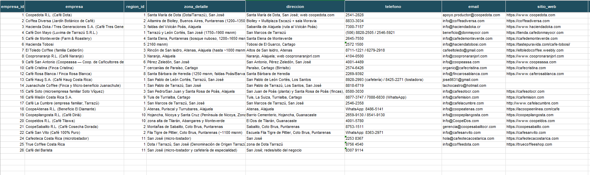
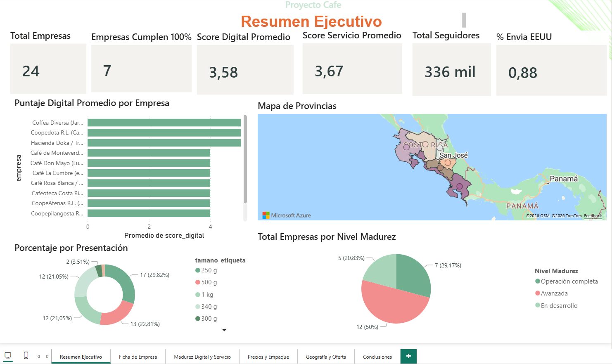
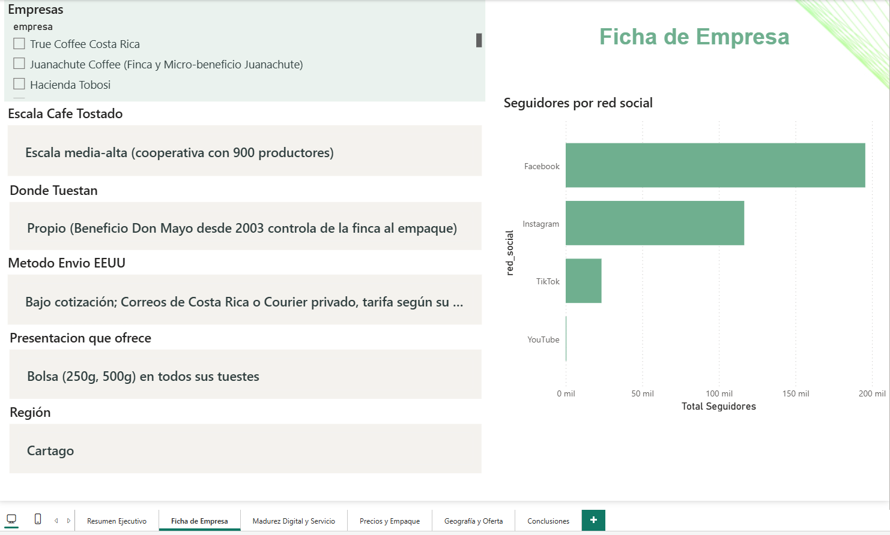
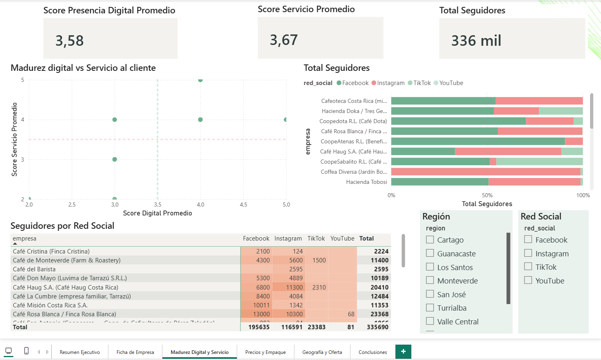
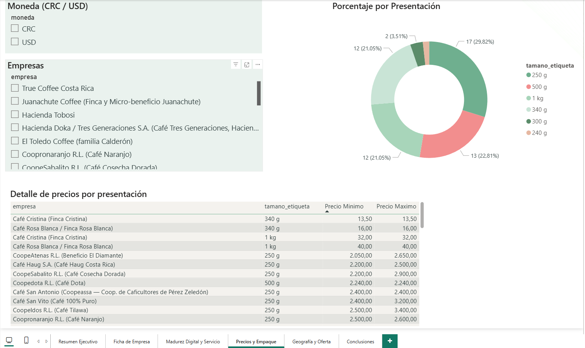
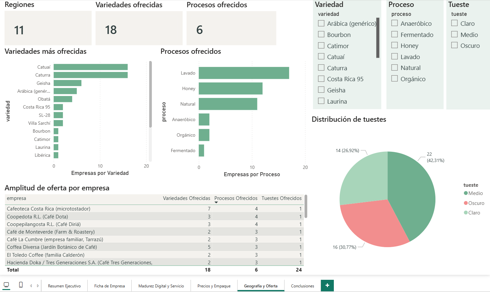
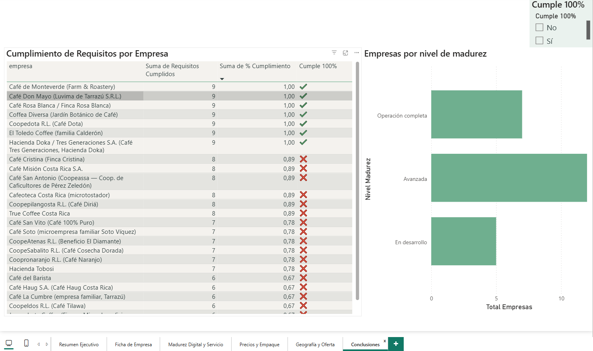

# Análisis de Mercado: Tostadores de Café de Costa Rica

Proyecto de inteligencia de negocios que analiza **24 tostadores de café de Costa Rica**, evaluando su cumplimiento de requisitos, desempeño digital, alcance en redes sociales, precios y distribución geográfica. El análisis va desde la **organización de los datos en Excel**, pasa por un **modelo de datos y dashboard interactivo en Power BI**, y cierra con un **documento de conclusiones en Word**.

---

## Dashboard en vivo

Puedes explorar el dashboard interactivo aquí:

** [Ver dashboard en Power BI](https://app.powerbi.com/links/s4Mzs6Sz4a?ctid=1d2e59b7-fa25-4404-8b95-d02dd4b7cb98&pbi_source=linkShare)**


---

## ¿Qué responde este proyecto?

- ¿Qué empresas cumplen los requisitos del negocio y en qué nivel?
- ¿Quiénes lideran en madurez digital y servicio al cliente?
- ¿Cómo se comparan los precios del café entre empresas y presentaciones?
- ¿Dónde se concentra geográficamente la competencia?
- ¿Qué variedades, procesos y tuestes ofrece cada tostador?

---

## Estructura del análisis

El proyecto se construyó en tres etapas, cada una con su propio entregable:

| Etapa | Herramienta | Para qué sirve |
|---|---|---|
| 1. Datos | Excel | Materia prima: empresas, precios, redes, variedades, regiones |
| 2. Modelo y visualización | Power BI | Modelo estrella + dashboard interactivo de 6 páginas |
| 3. Conclusiones | Word | Documento final con tabla de resultados y hallazgos |

---

## El modelo de datos

Los datos están organizados en un **modelo estrella**, con una tabla central de empresas conectada a tablas de hechos (precios, redes sociales, desempeño) y dimensiones (región, variedad, proceso, tueste, tamaño).

<!-- PEGA AQUÍ la captura del modelo / vista de relaciones de Power BI -->


---

## Páginas del dashboard

A continuación, cada página del dashboard con su captura y una breve descripción.

### 1. Resumen Ejecutivo
Vista general con los indicadores clave: empresas que tuestan, operación completa, niveles de madurez, ranking de desempeño y distribución geográfica.

<!-- PEGA AQUÍ la captura del Resumen Ejecutivo -->


### 2. Ficha de Empresa
Vista de detalle por empresa: al seleccionar una, todos los visuales se actualizan mostrando sus scores, redes, precios y catálogo.

<!-- PEGA AQUÍ la captura de la Ficha de Empresa -->


### 3. Madurez Digital y Servicio
Compara el desempeño digital y de servicio de cada empresa, con un gráfico de dispersión por cuadrantes y el alcance en redes sociales.

<!-- PEGA AQUÍ la captura de Madurez Digital -->


### 4. Precios y Empaque
Análisis de precios por empresa y por tamaño de presentación, con el detalle de cada presentación y los tamaños más ofrecidos.

<!-- PEGA AQUÍ la captura de Precios -->


### 5. Geografía y Oferta
Distribución de empresas por región, variedades más ofrecidas, procesos y tuestes disponibles en el mercado.

<!-- PEGA AQUÍ la captura de Geografía -->


### 6. Conclusiones
Página final con el análisis de cumplimiento, los niveles de madurez y el ranking de las 24 empresas.

<!-- PEGA AQUÍ la captura de Conclusiones -->


---

## 🔍 Principales hallazgos

- **Las 24 empresas tuestan su propio café**, por lo que todas son viables; esto valida la selección de la base de datos.
- **7 empresas tienen una operación 100% completa** (cumplen los 9 atributos evaluados).
- **El cumplimiento promedio del mercado es del 85%**, lo que indica un sector maduro.
- La mayoría de las empresas se ubica en niveles de madurez **avanzado** o **completo**; las demás solo presentan brechas puntuales, principalmente en **exportación** y **tienda en línea**.
- El mercado se concentra geográficamente en zonas como **Los Santos** y el **Valle Central Occidental**.

> El análisis no incluye datos de ventas, por lo que "mejor empresa" se define por desempeño digital, servicio, alcance y amplitud de oferta, sobre la base de que todas cumplen el requisito esencial de tostar su propio café.

---

## Contenido del repositorio

```
├── README.md
├── data/
│   └── modelo_estrella_cafe_powerbi.xlsx     # Datos en modelo estrella
├── powerbi/
│   └── dashboard_cafe.pbix                    # Archivo de Power BI
├── docs/
│   └── Analisis_Cafe_Costa_Rica.docx          # Documento de conclusiones
└── capturas/                                  # Imágenes del dashboard
    ├── modelo.png
    ├── 01-resumen.png
    ├── 02-ficha.png
    ├── 03-madurez.png
    ├── 04-precios.png
    ├── 05-geografia.png
    └── 06-conclusiones.png
```

> Ajusta los nombres de las carpetas y archivos según cómo los hayas subido a tu repositorio.

---

## Herramientas utilizadas

- **Microsoft Excel** — organización y limpieza de datos
- **Microsoft Power BI** — modelo de datos, medidas DAX y dashboard interactivo
- **Microsoft Word** — documento de conclusiones

---

## Autor

Carlos Oviedo Ballestero / Daniel Oviedo Ballestero

